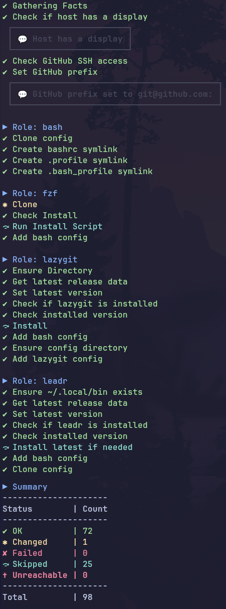

# 🛠️ Personal Ansible Configuration

This repository contains my personal Ansible setup used to configure and manage my systems consistently and efficiently.

## 📦 Contents

The playbook is meant to be run on localhost via `ansible-pull`.  
It is designed to install as many tools as possible on the user level and

<details>
<summary>to look good doing so 😎</summary>



</details>

---
Some dependencies require root privileges for system-wide installation which can be deployed using the `privileged` tag, see below.
Running the playbook without these privileges expects those packages to be installed already.

Another neat little feature is the custom stdout callback plugin, so the 

## 🚀 Usage

I'm not sure why you would want to use my config but don't let that stop you!

Clone and apply the configuration using `ansible-pull`:

```bash
ansible-pull -U https://github.com/ll-nick/ansible-config.git
```

To also deploy tasks that require root privileges, use:

```bash
ansible-pull -U https://github.com/ll-nick/ansible-config.git --tags all,privileged --ask-become-pass
```

For first time usage, there is also a [bash script](deploy/deploy.sh) that can be used
 to interactively install the required dependencies (including ansible itself), then execute the playbook.

During deployment, the `update-config` and `update-config-privileged` aliases are installed to update the configuration in the future.


## ♥️ Acknowledgements

Thanks to Jay from [Learn Linux TV](https://www.learnlinux.tv/) who [helped me get started](https://www.youtube.com/watch?v=gIDywsGBqf4).

For the callback plugin, I took some inspiration from Townk's [ansible-beautiful-output](https://github.com/Townk/ansible-beautiful-output).
